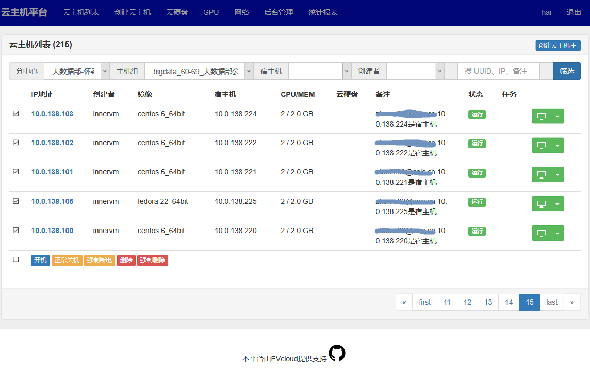

# [总体介绍]
> EVCloud是一个轻量级云主机管理平台，追求功能实用，运行稳定，维护简单。

## 项目主页
>    https://github.com/evcloud/

## 界面截图

# [开发环境、调试与运行]
## 系统软件环境准备
    dnf install fping nginx subversion mariadb-server
    dnf install gcc gcc-c++ python3-devel mariadb-devel libvirt libvirt-devel redhat-rpm-config 
## python3环境准备
    pip3 install mysqlclient libvirt-python
    pip3 install python-dateutil lxml numpy
    pip3 install django-oauth-toolkit coreapi djangorestframework==3.7.7 
    pip3 install uwsgi django==1.11.13 
## mysql and nginx
    systemctl start mariadb
    ln -s conf/nginx.conf /etc/nginx/conf.d/evcloud.conf
    systemctl start nginx
## novnc server
    cd /home
    mkdir novnc_token
    touch novnc_token/vnc_tokens
    cat run_novnc.sh 
    ps aux | grep "/usr/bin/websockify 0.0.0.0:8080 --daemon" | awk '{print "kill -9 " $2}' | sh
    websockify 0.0.0.0:8080 --daemon --web=/usr/share/novnc --token-plugin=TokenFile --token-source=/home/novnc_tokens/
    
## 调试运行
    python3 manage.py runserver 0.0.0.0:81 --settings=conf.settings_ol
    python3 manage.py shell --settings=conf.settings_ol
    web管理系统：   初始管理员用户名：evcloud 密码：  evcloud
    数据库：evcloud 用户名：root    口令：  evcloud
    
## uwsgi生产环境启动、重启与关闭    
    
# [Change Log]

evcloud_1.2

* 创建云主机页面前端检查宿主机创建云主机数量，宿主机内存和IP地址等资源是否能满足要求
